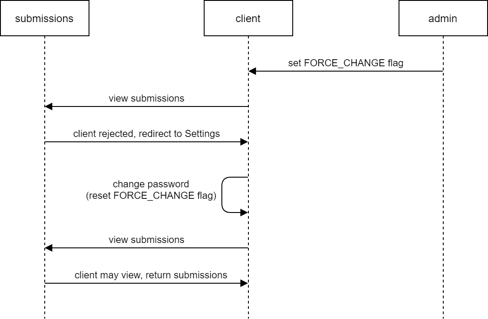
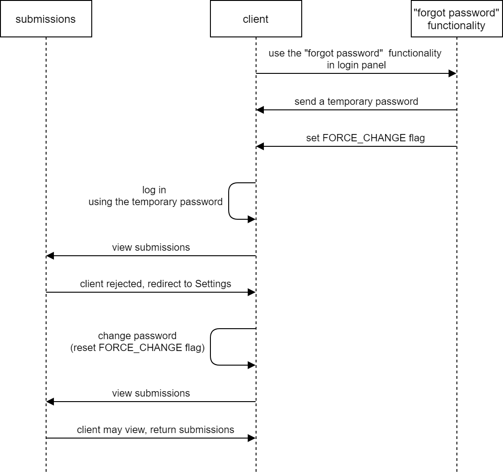

## Force Password Change module

This module gives administrators a new functionality to block users from viewing submissions by forcing them to change their passwords beforehand. The aims are:
1) to be able to force your Formtools clients to change their passwords at any time.
2) to have users use custom passwords, not the ones sent by the system or by the admin.

**This module is still under development**. Feel free to comment & request features using the [Issues tab](https://github.com/kubajal/module-force_password_change/issues) or per e-mail: kuba.jalowiec@protonmail.com.

### Dependencies

This module depends on the _Extended Client Fields_ module which you can download at [Formtools website](https://docs.formtools.org/modules/). _Extended Client Fields_ must remain enabled at all times in order for the _Force Password Change_ module to work. This dependency will be gone in the course of time.

For now, this module has been tested on:
- Formtools v3.0.0
- Extended Client Fields v2.1.0

### New field in the client panel

This module adds the *force_change_password* in the client panel with two options: *force_change* and *NO_EXPIRY*. Setting that field to the first option forces the given client to change their password on the next attempt to view any submissions assigned to them. The second option has no impact on the client and is the default value for the new field.

### Use-cases

There are two use-cases which this module handles:

1. the administrator wants the user to change their password for any reason, e.g. because it has been leaked or it has been sent as open text through an e-mail/message/etc.,
2. the user clicked on "forgot password" button on the login page; a temporary password has been sent to the user which they need now to change before viewing submissions again.

The below sequence diagrams show how both use cases are handled:

Use case no. 1:

Use case no. 2:

### Notifications for clients

See [lang/en_us.php](https://github.com/kubajal/module-force_password_change/blob/master/lang/en_us.php) to change notifications for clients.

### To do

1. [automatic password expiry](https://github.com/kubajal/module-force_password_change/milestone/2)
2. [adding "Settings" tab on module's subpage and getting rid of dependency on Extended Client Fields](https://github.com/kubajal/module-force_password_change/milestone/1)
3. [customizing message per client](https://github.com/kubajal/module-force_password_change/milestone/3)

### Reporting bugs

Please report any bugs or problems here: [https://github.com/kubajal/module-force_password_change/issues](https://github.com/kubajal/module-force_password_change/issues).

### Download

- [https://github.com/kubajal/module-force_password_change](https://github.com/kubajal/module-force_password_change)
